# 📚 Faithfulness-Aware RAG

> **A retrieval-augmented generation system that verifies its own answers against retrieved evidence and abstains rather than hallucinating.**


## 🌟 Executive Summary

**Faithfulness-Aware RAG** is a production-ready retrieval-augmented generation system that goes beyond standard Q&A by **verifying whether its own answer is actually supported by the retrieved evidence**. When the system's confidence is low, it abstains rather than hallucinating — making it suitable for legal, policy, and compliance use cases where accuracy matters.

The system retrieves relevant chunks from a vector store (ChromaDB), generates answers using Groq's LLM API, then runs a **faithfulness layer** that splits the answer into individual claims, checks each claim against the retrieved context, and verifies citation accuracy. Results are presented through a polished **Streamlit chat interface** with animated responses, faithfulness scoring, and file upload support.

## 🚀 Key Features

* **🔍 Section-Aware Retrieval:** Smart chunking for legal/policy documents with verified/unverified source labeling.
* **✅ Faithfulness Scoring:** Splits answers into individual claims and checks each against retrieved context.
* **📎 Citation Verification:** Detects fabricated "Section N" citations and flags them as unverified.
* **⚠️ Smart Abstention:** Refuses to answer when confidence is low instead of hallucinating.
* **📄 File Upload:** Ask questions about your own PDF/TXT documents via the "+" button.
* **🎨 Polished UI:** Chat-style interface with animated responses, scroll buttons, and a Claude/ChatGPT-style input pill.

## 🚀 Live Demo

**🔗 [Try it live on Streamlit Cloud](https://rag-faithfulnes-yoywrnbrbc2bzpa753clmv.streamlit.app/)**

> Enter your free Groq API key in the sidebar to start asking questions. Get a key at [console.groq.com/keys](https://console.groq.com/keys).

## 📊 How It Works

| Stage | Description |
| :--- | :--- |
| **🔍 Retrieve** | Embeds the query, pulls top-k chunks from ChromaDB, filters near-duplicates, and applies verified-preference ranking. |
| **💬 Generate** | Builds a grounded prompt with section verification tags and calls Groq's LLM API. |
| **✅ Faithfulness Check** | Splits the answer into claims, checks each against context, verifies citations, and computes a faithfulness score. |
| **⚠️ Abstain** | If the score falls below the threshold (70%) or the model declines, the system flags the answer as low confidence. |

## 🏗️ Architecture Diagram

```mermaid
graph TD
    A[👤 User] -->|Types question| B[🖥️ Streamlit Chat UI]
    A -->|Uploads PDF/TXT| B

    B -->|Query text| C[🔍 Retrieval Engine]
    B -->|File bytes| D[📄 Ingestion Pipeline]

    D -->|Extract text| E[pypdf / pdftotext]
    E -->|Raw text| F[✂️ Section-Aware Chunker]
    F -->|Chunks| G[sentence-transformers Embedder]
    G -->|Embeddings + Chunks| H[(🗄️ ChromaDB Vector Store)]

    C -->|Embed query| I[sentence-transformers Embedder]
    I -->|Query embedding| H
    H -->|Top-K chunks| C
    C -->|Ranked chunks| J[💬 Groq LLM API]
    J -->|Raw answer| K[✅ Faithfulness Layer]

    K -->|Split into claims| L[📋 Claim Extractor]
    L -->|Individual claims| M[⚖️ Entailment Checker]
    M -->|Grounded / Ungrounded| N[📎 Citation Verifier]
    N -->|Score + Verified Claims| O{Score ≥ 70%?}

    O -->|✅ Yes| P[📤 Display Answer + Scores]
    O -->|❌ No| Q[⚠️ Abstain - Low Confidence]

    style A fill:#4f46e5,color:#fff
    style B fill:#FF4B4B,color:#fff
    style H fill:#7c3aed,color:#fff
    style J fill:#10b981,color:#fff
    style K fill:#f59e0b,color:#000
    style P fill:#22c55e,color:#fff
    style Q fill:#ef4444,color:#fff
```



## ⚙️ Installation & Setup

### 1. Clone the Repository
```bash
git clone https://github.com/shankarin2k6/rag-faithfulness.git
cd rag-faithfulness
```

### 2. Install Dependencies
```bash
python3 -m venv venv
source venv/bin/activate
pip install -r requirements.txt
```
### 3. Configuration
```bash
cp .env.example .env
# Edit .env and paste your free Groq API key from https://console.groq.com/keys
```

### 4. Build the Vector Index
```bash
python src/ingest.py
```

### 5. Launch the App
```bash
streamlit run app.py
```
### Working Screenshots:


Thank You for visiting!!!

Developed by Shankari N.
